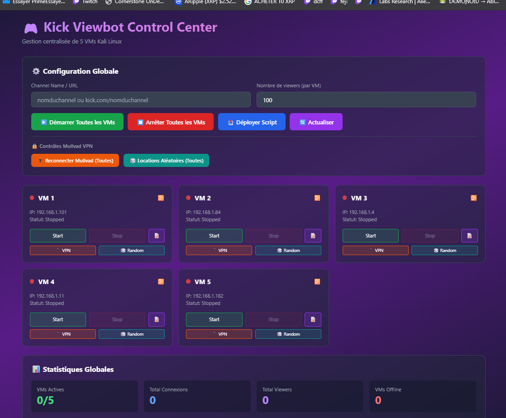

# kick-viewbot
for educational purpose only

fork adding multiples threads using mullvad vpn to maximize connexion - a simple dashboard to use on your main OS to randomly generate mullvad locations / restart the vm / restart the script 
Logs monitoring

for the moment it's just test on local  virtual machines sending queries to kick channels

Project to deploy the script with mullvad vpn to maximise the view count - up to 2000 reached with 5 vm

